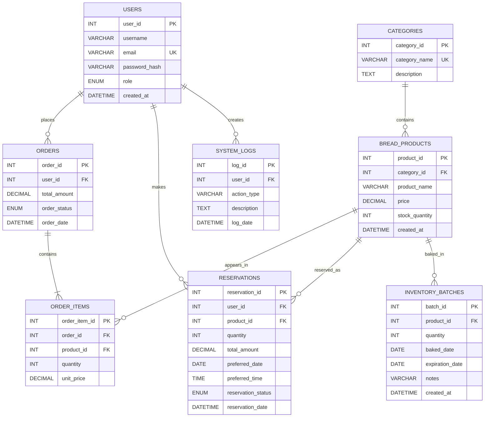

# PANADERO Database ERD

## Relationship summary

- `USERS` → `ORDERS`: one customer can place many orders.
- `USERS` → `RESERVATIONS`: one customer can make many reservations.
- `CATEGORIES` → `BREAD_PRODUCTS`: each category contains many products.
- `ORDERS` → `ORDER_ITEMS`: each order contains one or more line items.
- `BREAD_PRODUCTS` → `ORDER_ITEMS`: one product can be sold in many orders.
- `BREAD_PRODUCTS` → `RESERVATIONS`: one product can be reserved many times.
- `BREAD_PRODUCTS` → `INVENTORY_BATCHES`: one product can have many baking batches.
- `USERS` → `SYSTEM_LOGS`: a user can create many audit log entries.

`RESERVATIONS` and `INVENTORY_BATCHES` are the two compatibility tables created by `server.js` because they are needed by the existing pages but are not included in the supplied SQL file.
