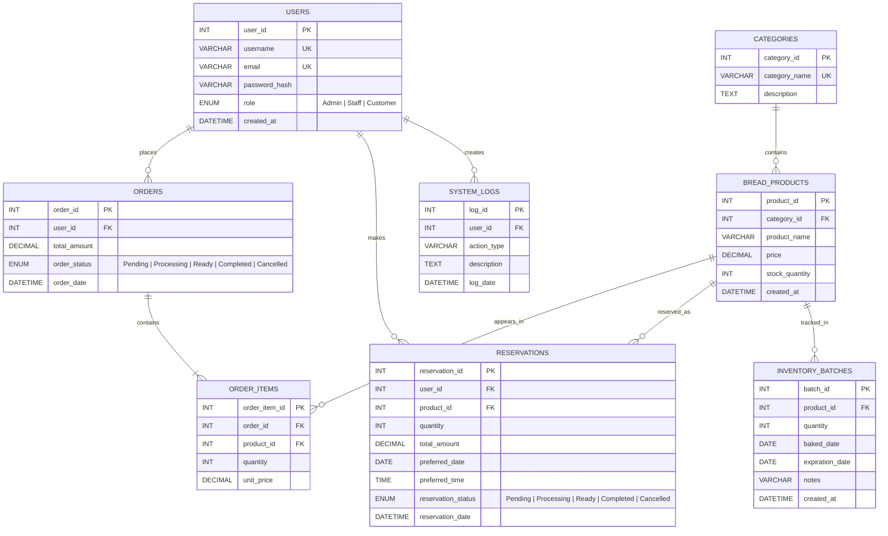

# PANADERO Local System — Canonical ERD

This is the canonical entity-relationship diagram for the local MySQL database `panadero_bakery`. It matches `database/panadero.sql` and the compatibility migrations in `server.js`.

## Relationship interpretation

- One user can place many orders.
- One user can make many reservations.
- One user can create many system-log records.
- One category contains many products.
- One order contains one or more order items.
- One product can appear in many order items.
- One product can be reserved many times.
- One product can have many inventory batches.
- `order_items.unit_price` preserves the price used at checkout even if the catalog price changes later.
- Current sellable stock is stored in `bread_products.stock_quantity`.
- Adding an inventory batch increases current product stock.
- A successful order or reservation decreases stock inside a database transaction.
- `system_logs` is included for audit history; the current application returns an empty log list until audit writes are added.

## Schema source and runtime migration

- **Canonical import file:** `database/panadero.sql`
- **Runtime compatibility:** `server.js` uses `CREATE TABLE IF NOT EXISTS` for `reservations` and `inventory_batches`, so an older database can still start safely.
- **Seed behavior:** `server.js` creates the initial categories, products, and demo Staff/Admin accounts when the corresponding tables are empty.

## Runtime-only data not shown in the ERD

- Browser cart: temporary local storage until checkout.
- Browser login session: token kept in browser storage; token sessions are held in the running Node.js process.
- API requests: HTTP messages handled by Express, not database tables.
- Product images: local static assets, not database records.
