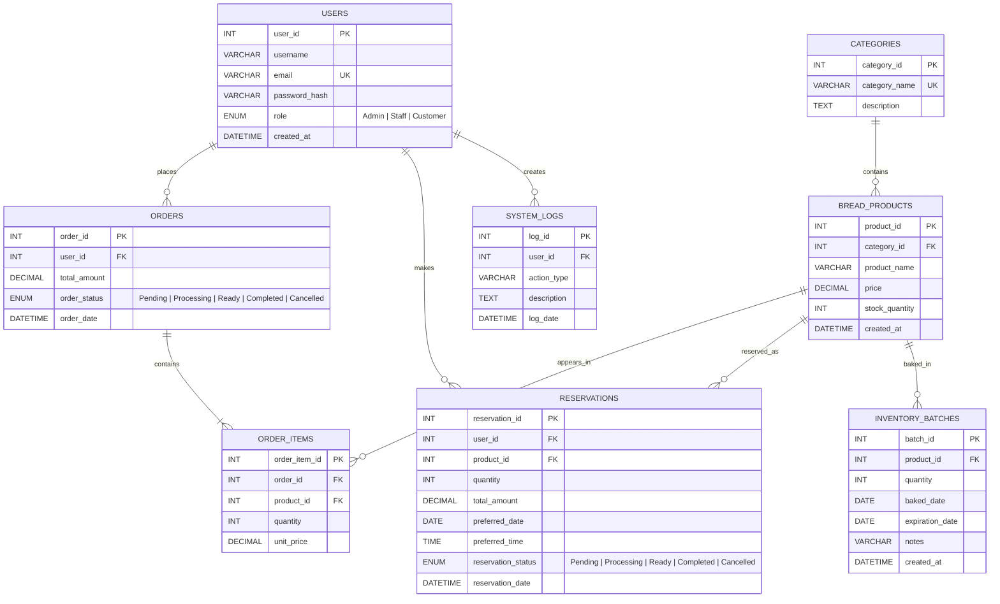

# PANADERO Local System — Updated ERD

This diagram describes the local MySQL database used by `server.js`. The supplied SQL creates the core tables. The Node.js startup migration creates `reservations` and `inventory_batches` when they are missing because the staff and customer features require them.

## Relationship interpretation

- One user can place many orders.
- One user can make many reservations.
- One user can create many system-log records.
- One category contains many products.
- One order has one or more order items.
- One product can appear in many order items.
- One product can be reserved many times.
- One product can have many inventory batches.
- `order_items.unit_price` preserves the price used at checkout even if the catalog price changes later.
- Current stock is stored in `bread_products.stock_quantity`.
- A new inventory batch increases the product's current stock.
- A successful order or reservation decreases current stock inside a database transaction.

## Runtime-only data not represented in the ERD

- Browser cart: stored temporarily in browser local storage until checkout.
- Browser login session: the browser stores a token, while the current Node.js process keeps the token-to-user session in memory.
- API requests: not database tables; they are HTTP requests handled by Express.
- Product image paths: served as local static assets and are not stored in the database.
