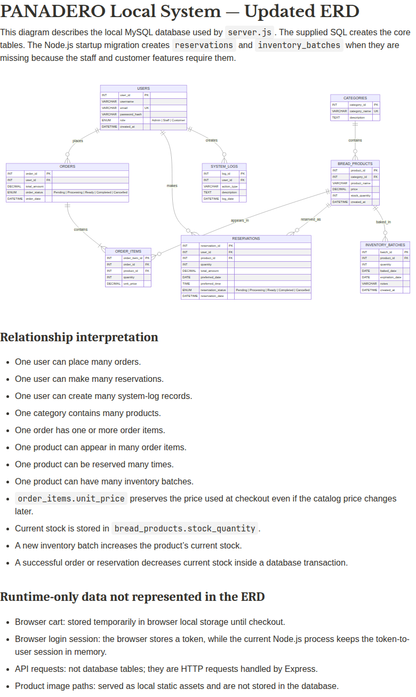

# PANADERO Baking System
## Local System Master Book

**Version:** Local laptop edition  
**Repository commit:** `02d4d3f`  
**Primary entry point:** `PANADERO-ONE-CLICK.bat`  
**Local URL:** `http://localhost:3000/login.html`

---

## Table of Contents

1. [Purpose and scope](#1-purpose-and-scope)
2. [The complete system in one picture](#2-the-complete-system-in-one-picture)
3. [Technology stack](#3-technology-stack)
4. [Project structure](#4-project-structure)
5. [How the local system starts](#5-how-the-local-system-starts)
6. [Frontend architecture](#6-frontend-architecture)
7. [Customer portal](#7-customer-portal)
8. [Staff portal](#8-staff-portal)
9. [Admin portal](#9-admin-portal)
10. [Node.js and Express backend](#10-nodejs-and-express-backend)
11. [Authentication and roles](#11-authentication-and-roles)
12. [MySQL database and SQL schema](#12-mysql-database-and-sql-schema)
13. [Updated ERD](#13-updated-erd)
14. [Complete business workflows](#14-complete-business-workflows)
15. [API reference](#15-api-reference)
16. [Important code patterns](#16-important-code-patterns)
17. [Data validation and security](#17-data-validation-and-security)
18. [Testing the local system](#18-testing-the-local-system)
19. [Troubleshooting](#19-troubleshooting)
20. [Maintenance and extension guide](#20-maintenance-and-extension-guide)
21. [Production limitations](#21-production-limitations)
22. [Glossary](#22-glossary)

---

# 1. Purpose and scope

PANADERO is a local bakery ordering and management system. It has three user-facing portals:

- **Customer:** browse products, use the cart, place orders, create reservations, and track activity.
- **Staff:** view inventory and batches, receive customer requests, and update request statuses.
- **Admin:** manage catalog information, users, inventory, requests, and system state.

The system uses a three-layer design:

1. **Frontend layer:** HTML, CSS, and browser JavaScript.
2. **Backend layer:** Node.js with Express.
3. **Database layer:** MySQL or MariaDB running locally through MySQL Server or XAMPP.

The browser never connects directly to MySQL. The browser sends HTTP requests to Node.js, and Node.js sends parameterized SQL queries to MySQL.

> The most important rule is: **HTML displays the interface, JavaScript sends requests, Node.js applies business rules, and MySQL stores the permanent data.**

This book explains the local edition. It is designed for a laptop or classroom environment and is started with `PANADERO-ONE-CLICK.bat` on Windows.

---

# 2. The complete system in one picture

```text
                         LOCAL LAPTOP
+----------------------------------------------------------------+
|                                                                |
|  Browser                                                       |
|  +------------------+  +------------------+  +---------------+ |
|  | Customer portal  |  | Staff portal     |  | Admin portal  | |
|  | HTML/CSS/JS      |  | HTML/CSS/JS      |  | HTML/CSS/JS   | |
|  +---------+--------+  +---------+--------+  +-------+-------+ |
|            |                     |                   |         |
|            +---------------------+-------------------+         |
|                                  | HTTP / JSON                  |
|                                  v                              |
|                    +---------------------------+               |
|                    | Node.js + Express         |               |
|                    | server.js                 |               |
|                    | routes, validation, auth |               |
|                    +-------------+-------------+               |
|                                  | mysql2 SQL                    |
|                                  v                              |
|                    +---------------------------+               |
|                    | MySQL / MariaDB           |               |
|                    | panadero_bakery database  |               |
|                    +---------------------------+               |
|                                                                |
+----------------------------------------------------------------+
```

## Request example: placing an order

```text
Customer clicks Submit Order
        |
        v
checkout.js collects product IDs and quantities
        |
        v
POST /api/orders with a Bearer token
        |
        v
server.js authenticates the customer
        |
        v
server.js reads current prices and stock from MySQL
        |
        v
MySQL transaction creates orders + order_items
and deducts stock
        |
        v
Node.js returns ORD-00005
        |
        v
checkout.js displays the success message and tracking link
```

---

# 3. Technology stack

| Layer | Technology | Responsibility |
|---|---|---|
| Markup | HTML5 | Page structure and forms |
| Styling | CSS3 | Layout, colors, responsive design |
| Browser logic | JavaScript | UI events, cart, API calls, rendering |
| Runtime | Node.js | Runs the backend process |
| Web framework | Express | HTTP server, routes, static files |
| Database driver | `mysql2` | Connects Node.js to MySQL |
| Password hashing | `bcryptjs` | Hashes and verifies passwords |
| Configuration | `dotenv` | Reads local `.env` settings |
| Cross-origin support | `cors` | Allows configured browser/API communication |
| Database | MySQL/MariaDB | Permanent records |
| Local launcher | Windows Batch | One-click setup and startup |

The main Node.js dependencies are declared in `package.json`:

```json
{
  "scripts": {
    "start": "node server.js",
    "dev": "node --watch server.js"
  },
  "dependencies": {
    "bcryptjs": "^2.4.3",
    "cors": "^2.8.5",
    "dotenv": "^16.4.5",
    "express": "^4.21.2",
    "mysql2": "^3.11.5"
  }
}
```

---

# 4. Project structure

The important local project structure is:

```text
PANADERO-LOCAL-FINAL/
|
|-- PANADERO-ONE-CLICK.bat       One-click Windows launcher
|-- login.html                   Separate role-based login page
|-- server.js                    Express backend and MySQL API
|-- package.json                 Node.js scripts and dependencies
|-- package-lock.json            Exact dependency versions
|-- .env.example                 Local configuration template
|-- Arambulo-and-galvez.sql      Supplied database schema and seed structure
|-- LOCAL-SETUP.md               Short local setup guide
|-- README.md                    Project overview
|
|-- PANADERO-COSTUMER/
|   `-- PANADERO-COSTUMER/
|       `-- PANADERO-COSTUMER/
|           |-- index.html       Customer home page
|           |-- menu.html        Product menu
|           |-- product.html     Product details
|           |-- cart.html        Cart page
|           |-- checkout.html    Order checkout
|           |-- reservation.html Reservation form
|           |-- track-order.html Order/reservation tracking
|           |-- login.html        Customer login and registration
|           |-- signup.html       Customer signup page
|           `-- assets/
|               |-- css/         Customer styles
|               |-- js/          Customer JavaScript services/pages
|               `-- images/       Logos and bakery images
|
|-- PANADERO-STAFF/
|   `-- PANADERO-STAFF/
|       |-- staff-dashboard.html
|       |-- staff-inventory.html
|       |-- staff-orders.html
|       `-- assets/
|           |-- css/staff.css
|           |-- js/              Staff data and page scripts
|           `-- images/
|
|-- PANADERO-ADMIN/
|   `-- Panadero-Admin/
|       `-- admin/
|           |-- admin.html
|           `-- assets/
|               |-- css/admin.css
|               |-- js/          Admin state and API synchronization
|               `-- images/
|
|-- database/
|   `-- 001_schema.sql           Schema compatibility reference
|
`-- docs/
    |-- PANADERO-LOCAL-SYSTEM-MASTER-BOOK.md
    |-- PANADERO-LOCAL-ERD-UPDATED.md
    |-- PANADERO-ERD.png
    `-- PANADERO-SYSTEM-GUIDE.md
```

## Source-of-truth rules

- `server.js` is the source of truth for backend rules, prices, stock checks, permissions, and database writes.
- `Arambulo-and-galvez.sql` is the source of truth for the supplied base database structure.
- The customer HTML/CSS files are the source of truth for the visual design.
- Customer service JavaScript is the adapter between the existing design and the API.
- `.env` is local-only and must never be committed or shared.

---

# 5. How the local system starts

## 5.1 One-click startup

On Windows, double-click:

```text
PANADERO-ONE-CLICK.bat
```

The launcher performs these steps:

```text
1. Change directory to the folder containing the batch file.
2. Check that node and npm exist.
3. Find mysql.exe in PATH, XAMPP, or common MySQL folders.
4. Create .env from .env.example if .env does not exist.
5. Try to start common MySQL/XAMPP services.
6. Run Arambulo-and-galvez.sql through mysql.exe.
7. Run npm install if node_modules is missing.
8. Start npm start in a separate server window.
9. Wait for GET /api/health to return success.
10. Open http://localhost:3000/login.html.
```

The launcher does not replace Node.js or MySQL. Those programs must already be installed. It can attempt to start common local MySQL services, but XAMPP can still require the user to start MySQL in the XAMPP Control Panel.

## 5.2 Manual startup

The equivalent manual commands are:

```bash
mysql -u root -p < Arambulo-and-galvez.sql
copy .env.example .env
npm install
npm start
```

Then open:

```text
http://localhost:3000/login.html
```

## 5.3 Environment configuration

The local `.env` file contains values like:

```env
PORT=3000
DB_HOST=127.0.0.1
DB_PORT=3306
DB_USER=root
DB_PASSWORD=
DB_NAME=panadero_bakery
DB_SSL=false
```

`server.js` loads these settings with `dotenv`:

```js
import 'dotenv/config';

const pool = mysql.createPool({
  host: process.env.DB_HOST || '127.0.0.1',
  port: Number(process.env.DB_PORT || 3306),
  user: process.env.DB_USER || 'root',
  password: process.env.DB_PASSWORD || '',
  database: process.env.DB_NAME || 'panadero_bakery',
  waitForConnections: true,
  connectionLimit: 10,
  decimalNumbers: true,
  ...(process.env.DB_SSL === 'true'
    ? { ssl: { rejectUnauthorized: false } }
    : {})
});
```

The backend owns the database credentials. The frontend never receives them.

---

# 6. Frontend architecture

Each page is built from three types of frontend files:

1. **HTML page:** elements, forms, IDs, buttons, and script references.
2. **CSS files:** visual design only.
3. **JavaScript files:** page behavior and API communication.

The normal customer script order is:

```html
<script>window.PANADERO_API="/api";</script>
<script src="assets/js/products.js" defer></script>
<script src="assets/js/product-service.js" defer></script>
<script src="assets/js/auth-service.js" defer></script>
<script src="assets/js/navigation.js" defer></script>
<script src="assets/js/cart.js" defer></script>
<script src="assets/js/page-script.js" defer></script>
```

## 6.1 Why the order matters

- `products.js` provides initial data and fallback values.
- `product-service.js` creates `ProductService`.
- `auth-service.js` creates `AuthService`.
- `navigation.js` uses `AuthService` to render the correct header.
- `cart.js` uses `ProductService` to resolve product details.
- The final page script renders the current page.

If a script is removed or loaded in the wrong order, the page can show an empty menu or produce `ProductService is not defined` errors.

## 6.2 API base URL

The browser uses:

```js
const API = window.PANADERO_API || '/api';
```

For the local system, `/api` means the same local Node.js server, such as:

```text
http://localhost:3000/api/catalog
```

This avoids hard-coding a cloud URL and keeps the local package portable.

## 6.3 Product service pattern

The customer product service first loads the catalog from the backend:

```js
async refreshProducts() {
  try {
    const response = await fetch((window.PANADERO_API || '/api') + '/catalog');
    if (!response.ok) return false;

    const result = await response.json();
    data.products = (result.products || []).map(product => ({
      ...product,
      image: product.image ||
        (product.slug ? `assets/images/${product.slug}.jpg` : data.fallbackImage)
    }));

    data.categories = (result.categories || []).map(category => ({
      ...category,
      id: categorySlug(category.name)
    }));

    return true;
  } catch (_) {
    return false;
  }
}
```

This preserves the updated visual assets while allowing the SQL catalog to control product names, prices, and stock.

---

# 7. Customer portal

## 7.1 Main customer pages

| Page | Main script | Purpose |
|---|---|---|
| `index.html` | `home.js` | Home banner and category links |
| `menu.html` | `menu.js` | Search, category filtering, product cards |
| `product.html` | `product.js` | Product details and add-to-cart action |
| `cart.html` | `cart-page.js` | Review and change cart items |
| `checkout.html` | `checkout.js` | Submit an order |
| `reservation.html` | `reservation.js` | Submit a reservation |
| `track-order.html` | `orders.js` | View orders and reservations |
| `login.html` | `auth.js` | Customer login and registration |
| `signup.html` | `auth.js` | Customer registration |

## 7.2 Browsing the menu

The menu flow is:

```text
menu.html loads
    |
    v
menu.js calls ProductService.refreshProducts()
    |
    v
product-service.js calls GET /api/catalog
    |
    v
server.js queries categories + bread_products
    |
    v
The response returns products, categories, prices, stock, and slugs
    |
    v
menu.js renders product cards
```

A product card links to:

```text
product.html?slug=baguette
```

## 7.3 Cart behavior

The cart is intentionally temporary browser data. It is not a permanent database record until checkout.

```text
Product page
   -> CartService.addItem(productId, quantity)
   -> localStorage cart
   -> cart.html displays items
   -> checkout.html reads detailed cart
```

The cart is not trusted for final pricing. At checkout, the browser sends product IDs and quantities only.

## 7.4 Customer authentication

The customer auth adapter sends login data to the backend:

```js
async login(email, password) {
  const result = await request('/auth/login', {
    method: 'POST',
    body: JSON.stringify({ email, password })
  });

  if (result.ok) save(result.user, result.token);
  return result;
}
```

The browser stores:

- Basic user display data in `localStorage`.
- The temporary API token in `localStorage`.

Every protected request adds:

```http
Authorization: Bearer <token>
```

## 7.5 Checkout behavior

The checkout form collects:

- First name
- Last name
- Email
- Mobile number
- Pickup or delivery
- Preferred date and time
- Delivery address when applicable

The browser sends an order like:

```json
{
  "items": [
    { "productId": "2", "quantity": 2 }
  ],
  "fulfillment": {
    "method": "pickup",
    "deliveryAddress": "",
    "preferredDate": "",
    "preferredTime": ""
  }
}
```

The server does not trust the browser's displayed total. It obtains the product price from MySQL, calculates the total, and stores the authoritative value.

## 7.6 Order confirmation

After a successful response, the checkout page shows a reference such as:

```text
Order placed successfully. Reference: ORD-00005.
```

The cart is cleared only after the backend confirms success.

## 7.7 Reservations

Reservations use the same general pattern as orders, but store a scheduled product request in `reservations`:

```text
reservation.html
   -> reservation.js
   -> ReservationService.createReservation()
   -> POST /api/reservations
   -> MySQL reservations row
   -> stock deduction
   -> RES-00001 response
```

---

# 8. Staff portal

## 8.1 Staff pages

| Page | Purpose |
|---|---|
| `staff-dashboard.html` | Summary and staff overview |
| `staff-inventory.html` | Products, stock, and batches |
| `staff-orders.html` | Customer orders and reservations |

Important files:

```text
PANADERO-STAFF/PANADERO-STAFF/assets/js/staff-data.js
PANADERO-STAFF/PANADERO-STAFF/assets/js/staff-inventory.js
PANADERO-STAFF/PANADERO-STAFF/assets/js/staff-orders.js
PANADERO-STAFF/PANADERO-STAFF/assets/js/staff-shell.js
PANADERO-STAFF/PANADERO-STAFF/assets/js/portal-guard.js
```

## 8.2 Loading staff inventory

```text
staff-inventory.html loads
    |
    v
staff-data.js reads the saved API token
    |
    v
GET /api/inventory
    |
    v
server.js checks staff/admin role
    |
    v
MySQL returns categories, products, stock, and inventory_batches
    |
    v
staff-inventory.js renders product rows and batch rows
```

The request must include the token. Without it, the backend correctly returns:

```json
{
  "ok": false,
  "code": "UNAUTHORIZED",
  "message": "Please sign in first."
}
```

## 8.3 Updating product stock

The staff interface calls:

```http
PATCH /api/inventory/products/:id/stock
Content-Type: application/json
Authorization: Bearer <staff-token>
```

Body:

```json
{ "stock": 80 }
```

The server validates that the value is a whole number greater than or equal to zero before updating `bread_products.stock_quantity`.

## 8.4 Adding a baking batch

The staff interface calls:

```http
POST /api/inventory/batches
```

Body:

```json
{
  "productId": "2",
  "quantity": 30,
  "bakedDate": "2026-10-08",
  "expirationDate": "2026-10-10",
  "notes": "Morning batch"
}
```

The server performs two related operations in one transaction:

1. Insert the batch into `inventory_batches`.
2. Increase `bread_products.stock_quantity` by the batch quantity.

## 8.5 Updating request statuses

The staff request table displays orders and reservations. Status values are:

```text
Pending -> Processing -> Ready -> Completed
                           |
                           v
                       Cancelled
```

The API endpoints are:

```http
PATCH /api/orders/:id/status
PATCH /api/reservations/:id/status
```

The server normalizes the status before saving it to the database enum.

---

# 9. Admin portal

## 9.1 Admin state model

The admin page loads a complete state snapshot from:

```http
GET /api/admin/state
```

The response includes:

- Categories
- Products
- Users
- Orders
- Reservations
- Inventory batches
- Current stock
- Logs placeholder

The admin JavaScript renders the existing tables and controls without changing the visual shell.

## 9.2 Admin synchronization

When admin changes are saved, the current state is sent to:

```http
POST /api/admin/sync
```

The backend synchronizes:

- Existing and new categories
- Existing and new products
- User display data, email, and role
- Product stock values
- Order statuses
- Reservation statuses

The synchronization is wrapped in a MySQL transaction. If one part fails, the transaction is rolled back.

## 9.3 Admin permissions

The backend uses the `admin` middleware:

```js
function admin(req, res, next) {
  if (!req.user) {
    return fail(res, 401, 'Please sign in first.', 'UNAUTHORIZED');
  }

  if (req.user.role !== 'admin') {
    return fail(res, 403, 'Admin access required.', 'FORBIDDEN');
  }

  next();
}
```

This prevents customer or staff tokens from using admin endpoints.

---

# 10. Node.js and Express backend

## 10.1 Server responsibilities

`server.js` is responsible for:

- Loading environment variables.
- Creating the MySQL connection pool.
- Running startup migrations.
- Seeding default categories, products, and demo accounts.
- Serving the frontend files.
- Handling authentication.
- Validating roles.
- Reading and writing MySQL data.
- Calculating order totals.
- Deducting stock.
- Returning JSON responses.

## 10.2 Server startup

The startup sequence is:

```js
const databaseReady = migrate();

app.use(async (_req, res, next) => {
  try {
    await databaseReady;
    next();
  } catch (error) {
    console.error('Database initialization failed:', error.message);
    fail(res, 503, 'Database connection failed.', 'DB_UNAVAILABLE');
  }
});
```

This prevents normal API routes from running before the database compatibility tables and seed checks finish.

## 10.3 Connection pool

A pool allows the backend to reuse database connections rather than opening a new connection for every query.

```js
const pool = mysql.createPool({
  host: process.env.DB_HOST || '127.0.0.1',
  port: Number(process.env.DB_PORT || 3306),
  user: process.env.DB_USER || 'root',
  password: process.env.DB_PASSWORD || '',
  database: process.env.DB_NAME || 'panadero_bakery',
  waitForConnections: true,
  connectionLimit: 10,
  decimalNumbers: true
});
```

## 10.4 Middleware order

The backend order is important:

```text
Load environment
   |
Create Express app
   |
Enable CORS and JSON parsing
   |
Create MySQL pool
   |
Start migration promise
   |
Wait for database before routes
   |
Register routes
   |
Serve static portals
   |
Start local server
```

## 10.5 Static file routes

The server exposes these local paths:

```text
/login.html
/customer/*
/staff/*
/admin/*
/
```

The root path redirects to the customer home page. The separate login page is the recommended entry point.

---

# 11. Authentication and roles

## 11.1 User roles

The database role enum is:

```text
Admin
Staff
Customer
```

The JavaScript/API representation normalizes them to lowercase:

```text
admin
staff
customer
```

## 11.2 Login process

```text
User submits email + password
        |
        v
POST /api/auth/login
        |
        v
Server selects the user by email
        |
        v
bcrypt compares the password with password_hash
        |
        v
Server creates a random session token
        |
        v
Browser stores user + token
        |
        v
login.html redirects by role
```

The login response resembles:

```json
{
  "ok": true,
  "user": {
    "id": "1",
    "displayName": "System Admin",
    "email": "admin@panadero.local",
    "role": "admin"
  },
  "token": "temporary-session-token"
}
```

## 11.3 Password storage

Passwords are never stored as plain text. Registration uses:

```js
const hash = await bcrypt.hash(password, 12);
```

Login verifies:

```js
await bcrypt.compare(password, rows[0].password_hash)
```

## 11.4 Session behavior

The local system uses an in-memory `Map` in the Node.js process:

```js
const sessions = new Map();

function tokenFor(user) {
  const token = crypto.randomBytes(32).toString('hex');
  sessions.set(token, user);
  return token;
}
```

This is suitable for local testing. Restarting the Node.js server invalidates existing tokens.

## 11.5 Role redirect behavior

```text
Customer -> /customer/index.html
Staff    -> /staff/staff-dashboard.html
Admin    -> /admin/admin.html
```

The staff and admin portal guards send unauthenticated users back to the login page.

---

# 12. MySQL database and SQL schema

## 12.1 Database creation

The first lines of the supplied SQL are:

```sql
CREATE DATABASE IF NOT EXISTS panadero_bakery;
USE panadero_bakery;
```

That means the database is created automatically when the launcher imports the SQL file, assuming the MySQL account has permission to create databases.

## 12.2 Tables

| Table | Main responsibility |
|---|---|
| `users` | Login accounts and roles |
| `categories` | Breads, Cakes, Doughnuts, Pies |
| `bread_products` | Product name, price, category, and current stock |
| `orders` | Order header, customer, total, status, date |
| `order_items` | Products and quantities inside an order |
| `reservations` | Scheduled product requests |
| `inventory_batches` | Fresh baking batch records |
| `system_logs` | Audit-log structure for future use |

## 12.3 Users table

```sql
CREATE TABLE IF NOT EXISTS users (
    user_id INT AUTO_INCREMENT PRIMARY KEY,
    username VARCHAR(50) NOT NULL UNIQUE,
    email VARCHAR(100) NOT NULL UNIQUE,
    password_hash VARCHAR(255) NOT NULL,
    role ENUM('Admin', 'Staff', 'Customer')
        NOT NULL DEFAULT 'Customer',
    created_at DATETIME DEFAULT CURRENT_TIMESTAMP
);
```

## 12.4 Categories table

```sql
CREATE TABLE IF NOT EXISTS categories (
    category_id INT AUTO_INCREMENT PRIMARY KEY,
    category_name VARCHAR(50) NOT NULL UNIQUE,
    description TEXT NULL
);
```

## 12.5 Products table

```sql
CREATE TABLE IF NOT EXISTS bread_products (
    product_id INT AUTO_INCREMENT PRIMARY KEY,
    category_id INT NOT NULL,
    product_name VARCHAR(100) NOT NULL,
    price DECIMAL(10, 2) NOT NULL,
    stock_quantity INT NOT NULL DEFAULT 0,
    created_at DATETIME DEFAULT CURRENT_TIMESTAMP,
    FOREIGN KEY (category_id) REFERENCES categories(category_id)
        ON DELETE RESTRICT
        ON UPDATE CASCADE
);
```

The product image is not stored in MySQL. The frontend builds a local image path from the product slug, such as:

```text
assets/images/croissant.jpg
```

## 12.6 Orders and order items

An order uses a header/detail structure:

```sql
CREATE TABLE IF NOT EXISTS orders (
    order_id INT AUTO_INCREMENT PRIMARY KEY,
    user_id INT NOT NULL,
    total_amount DECIMAL(10, 2) NOT NULL DEFAULT 0.00,
    order_status ENUM('Pending', 'Processing', 'Ready',
                     'Completed', 'Cancelled')
        NOT NULL DEFAULT 'Pending',
    order_date DATETIME DEFAULT CURRENT_TIMESTAMP,
    FOREIGN KEY (user_id) REFERENCES users(user_id)
        ON DELETE RESTRICT
);
```

```sql
CREATE TABLE IF NOT EXISTS order_items (
    order_item_id INT AUTO_INCREMENT PRIMARY KEY,
    order_id INT NOT NULL,
    product_id INT NOT NULL,
    quantity INT NOT NULL,
    unit_price DECIMAL(10, 2) NOT NULL,
    FOREIGN KEY (order_id) REFERENCES orders(order_id)
        ON DELETE CASCADE,
    FOREIGN KEY (product_id) REFERENCES bread_products(product_id)
        ON DELETE RESTRICT
);
```

`unit_price` records the price at the time of purchase. This is important because the catalog price can change later.

## 12.7 Runtime compatibility tables

The supplied SQL did not contain the reservation and batch tables needed by the existing pages. `server.js` creates them on startup:

```sql
CREATE TABLE IF NOT EXISTS reservations (
    reservation_id INT AUTO_INCREMENT PRIMARY KEY,
    user_id INT NOT NULL,
    product_id INT NOT NULL,
    quantity INT NOT NULL,
    total_amount DECIMAL(10, 2) NOT NULL,
    preferred_date DATE NOT NULL,
    preferred_time TIME NOT NULL,
    reservation_status ENUM('Pending', 'Processing', 'Ready',
                            'Completed', 'Cancelled')
        NOT NULL DEFAULT 'Pending',
    reservation_date DATETIME DEFAULT CURRENT_TIMESTAMP,
    FOREIGN KEY (user_id) REFERENCES users(user_id),
    FOREIGN KEY (product_id) REFERENCES bread_products(product_id)
);
```

```sql
CREATE TABLE IF NOT EXISTS inventory_batches (
    batch_id INT AUTO_INCREMENT PRIMARY KEY,
    product_id INT NOT NULL,
    quantity INT NOT NULL,
    baked_date DATE NOT NULL,
    expiration_date DATE NOT NULL,
    notes VARCHAR(500),
    created_at DATETIME DEFAULT CURRENT_TIMESTAMP,
    FOREIGN KEY (product_id) REFERENCES bread_products(product_id)
);
```

## 12.8 Seed behavior

On startup, if the catalog is empty, the backend inserts:

- Four categories.
- Fifteen bakery products.
- Stock quantity of 100 for the initial products.
- Demo admin account.
- Demo staff account.

The seed check avoids duplicating the default catalog on every restart.

---

# 13. Updated ERD

The complete updated Mermaid ERD is in:

```text
docs/PANADERO-LOCAL-ERD-UPDATED.md
```

The rendered visual ERD is included below and is also provided as
`docs/PANADERO-LOCAL-ERD-UPDATED.png`.



The central relationships are:

```text
USERS 1 ---- many ORDERS
USERS 1 ---- many RESERVATIONS
USERS 1 ---- many SYSTEM_LOGS
CATEGORIES 1 ---- many BREAD_PRODUCTS
ORDERS 1 ---- many ORDER_ITEMS
BREAD_PRODUCTS 1 ---- many ORDER_ITEMS
BREAD_PRODUCTS 1 ---- many RESERVATIONS
BREAD_PRODUCTS 1 ---- many INVENTORY_BATCHES
```

## ERD reading example

If a customer places an order:

1. `users.user_id` identifies the customer.
2. A row is created in `orders` with that `user_id`.
3. One or more rows are created in `order_items` with that `order_id`.
4. Each order item points to a `bread_products.product_id`.
5. The product stock is reduced.

The detailed ERD source is included with the project and can be rendered as a PNG using:

```bash
manus-render-diagram docs/PANADERO-LOCAL-ERD-UPDATED.md docs/PANADERO-LOCAL-ERD-UPDATED.png
```

---

# 14. Complete business workflows

## 14.1 Startup workflow

```text
One-click batch
   -> MySQL available
   -> SQL imported
   -> .env available
   -> npm packages installed
   -> Node server starts
   -> migrate() runs
   -> compatibility tables created
   -> demo records checked
   -> /api/health succeeds
   -> browser opens login.html
```

## 14.2 Customer registration workflow

```text
signup.html
   -> auth.js reads the form
   -> AuthService.register(payload)
   -> POST /api/auth/register
   -> validate required fields
   -> check duplicate email
   -> bcrypt hash password
   -> INSERT users
   -> create session token
   -> return user + token
   -> customer portal opens
```

## 14.3 Login workflow

```text
login.html
   -> AuthService.login(email, password)
   -> POST /api/auth/login
   -> SELECT users WHERE email = ?
   -> bcrypt.compare()
   -> tokenFor(user)
   -> role-based redirect
```

## 14.4 Catalog workflow

```text
menu.js
   -> ProductService.refreshProducts()
   -> GET /api/catalog
   -> SELECT categories
   -> SELECT bread_products JOIN categories
   -> normalize category slugs
   -> return product JSON
   -> render product cards
```

## 14.5 Order workflow with transaction

```text
1. Customer selects a product.
2. Product ID and quantity enter the cart.
3. Customer submits checkout.
4. Browser checks that a customer is logged in.
5. Browser sends IDs and quantities to POST /api/orders.
6. Server starts a transaction.
7. Server SELECTs products FOR UPDATE.
8. Server verifies every product exists.
9. Server verifies every quantity is valid.
10. Server verifies current stock is sufficient.
11. Server calculates total from database prices.
12. Server inserts orders.
13. Server inserts order_items.
14. Server decreases stock.
15. Server commits the transaction.
16. Server returns the order reference.
17. Browser displays success and clears the cart.
```

If steps 7–14 fail, the transaction rolls back. This prevents an order from being saved without its items or stock update.

## 14.6 Reservation workflow

```text
reservation.html
   -> collect product, quantity, date, and time
   -> POST /api/reservations
   -> authenticate customer
   -> validate product and stock
   -> calculate database total
   -> insert reservation
   -> deduct stock
   -> commit
   -> return reservation reference
```

## 14.7 Staff status workflow

```text
Customer creates order: Pending
Staff accepts work:    Processing
Bakery finishes:       Ready
Customer receives it:  Completed
Cancelled request:     Cancelled
```

## 14.8 Admin synchronization workflow

```text
Admin page loads
   -> GET /api/admin/state
   -> render complete state
   -> admin edits records
   -> POST /api/admin/sync
   -> backend begins transaction
   -> update categories/products/users/stock/statuses
   -> commit or rollback
```

---

# 15. API reference

All URLs below are relative to:

```text
http://localhost:3000/api
```

## 15.1 Health and catalog

| Method | Endpoint | Auth | Purpose |
|---|---|---|---|
| `GET` | `/health` | No | Check server and database |
| `GET` | `/catalog` | No | Load categories and products |

Example health response:

```json
{
  "ok": true,
  "database": true
}
```

## 15.2 Authentication

| Method | Endpoint | Auth | Purpose |
|---|---|---|---|
| `POST` | `/auth/register` | No | Create customer account |
| `POST` | `/auth/login` | No | Verify credentials and create token |
| `POST` | `/auth/logout` | Yes | Remove active session tokens |
| `POST` | `/auth/password-reset` | No | Record a reset request response |

## 15.3 Customer records

| Method | Endpoint | Auth | Purpose |
|---|---|---|---|
| `POST` | `/orders` | Customer | Create order |
| `GET` | `/orders` | Customer | Load current user's orders |
| `POST` | `/reservations` | Customer | Create reservation |
| `GET` | `/reservations` | Customer | Load current user's reservations |

## 15.4 Staff records

| Method | Endpoint | Auth | Purpose |
|---|---|---|---|
| `GET` | `/inventory` | Staff/Admin | Load products, stock, batches |
| `PATCH` | `/inventory/products/:id/stock` | Staff/Admin | Set stock |
| `POST` | `/inventory/batches` | Staff/Admin | Add baking batch |
| `GET` | `/staff/requests` | Staff/Admin | Load all requests |
| `PATCH` | `/orders/:id/status` | Staff/Admin | Update order status |
| `PATCH` | `/reservations/:id/status` | Staff/Admin | Update reservation status |

## 15.5 Admin records

| Method | Endpoint | Auth | Purpose |
|---|---|---|---|
| `GET` | `/admin/state` | Admin | Load complete admin state |
| `POST` | `/admin/sync` | Admin | Save admin changes |

## 15.6 Request headers

Protected requests require:

```http
Content-Type: application/json
Authorization: Bearer <token>
```

## 15.7 Error format

The backend uses:

```json
{
  "ok": false,
  "code": "UNAUTHORIZED",
  "message": "Please sign in first."
}
```

Common codes include:

| Code | Meaning |
|---|---|
| `UNAUTHORIZED` | Token is missing or invalid |
| `FORBIDDEN` | Role is not allowed |
| `CUSTOMER_ONLY` | Endpoint requires a customer |
| `DUPLICATE_EMAIL` | Email already exists |
| `DB_UNAVAILABLE` | MySQL connection failed |
| `ERROR` | General request error |

---

# 16. Important code patterns

## 16.1 JSON response helpers

```js
const ok = (res, data = {}) => res.json({ ok: true, ...data });
const fail = (res, status, message, code = 'ERROR') =>
  res.status(status).json({ ok: false, code, message });
```

These make frontend handling consistent:

```js
const result = await response.json();
if (!result.ok) {
  showError(result.message);
}
```

## 16.2 Authentication middleware

```js
function auth(req, res, next) {
  const token = clean(req.headers.authorization)
    .replace(/^Bearer\s+/i, '');
  const session = sessions.get(token);

  if (!session) {
    return fail(res, 401, 'Please sign in first.', 'UNAUTHORIZED');
  }

  req.user = session;
  next();
}
```

## 16.3 Parameterized SQL

The backend uses placeholders instead of concatenating user input:

```js
const [rows] = await pool.query(
  'SELECT * FROM users WHERE email=?',
  [email]
);
```

This reduces SQL-injection risk and keeps values separate from SQL syntax.

## 16.4 Order transaction pattern

```js
const conn = await pool.getConnection();
try {
  await conn.beginTransaction();

  // Read and lock current product rows.
  // Validate stock and calculate the server-side total.
  // Insert order header and detail rows.
  // Decrease stock.

  await conn.commit();
  ok(res, { message: 'Order accepted.' });
} catch (error) {
  await conn.rollback();
  fail(res, 400, error.message || 'Unable to create request.');
} finally {
  conn.release();
}
```

## 16.5 Server-side price calculation

```js
const product = byId.get(String(item.productId));
const quantity = Number(item.quantity);

if (!product || !Number.isSafeInteger(quantity) || quantity < 1) {
  throw new Error('Invalid product quantity.');
}

if (product.stock_quantity < quantity) {
  throw new Error(`Insufficient stock for ${product.product_name}.`);
}

total += Number(product.price) * quantity;
```

The frontend's displayed price is for user experience only. MySQL is authoritative.

## 16.6 Frontend API helper pattern

```js
async function request(path, options = {}) {
  const headers = {
    'Content-Type': 'application/json',
    ...(options.headers || {})
  };

  const token = localStorage.getItem('panadero-api-token');
  if (token) headers.Authorization = `Bearer ${token}`;

  const response = await fetch('/api' + path, {
    ...options,
    headers
  });

  return response.json();
}
```

## 16.7 Logout pattern

```js
async logout() {
  try {
    await request('/auth/logout', { method: 'POST' });
  } catch (_) {
    // Local cleanup still happens if the server is unavailable.
  }

  localStorage.removeItem('panadero-auth-session-v2');
  localStorage.removeItem('panadero-api-token');
}
```

---

# 17. Data validation and security

## 17.1 Current protections

The local edition already includes:

- Bcrypt password hashing.
- Bearer token checks on protected API routes.
- Role checks for customer, staff, and admin actions.
- Server-side product price lookup.
- Server-side stock validation.
- Parameterized SQL queries.
- Database transactions for orders and inventory batches.
- Foreign-key relationships.
- Local-only `.env` exclusion from Git.
- No direct database credentials in frontend files.

## 17.2 What the browser is allowed to decide

The browser may decide:

- Which product the user clicks.
- The temporary cart quantity.
- Form field values.
- Which page to display.

The browser may not be trusted for:

- Final price.
- Available stock.
- Role permissions.
- Customer ownership of records.
- Whether an order really succeeded.

## 17.3 What the server decides

The server decides:

- Whether a token is valid.
- Whether the role can use an endpoint.
- Whether a product exists.
- Whether stock is sufficient.
- What the final total is.
- Whether a row is inserted.
- Whether stock is deducted.

## 17.4 Local-system limitation

The session map is stored in memory. This means:

- Restarting Node.js logs users out.
- Multiple backend processes do not share sessions.
- The system is appropriate for local/classroom use.

---

# 18. Testing the local system

## 18.1 Basic health test

Open:

```text
http://localhost:3000/api/health
```

Expected response:

```json
{"ok":true,"database":true}
```

## 18.2 Catalog test

Open:

```text
http://localhost:3000/api/catalog
```

Expected result:

- Four categories.
- Fifteen seeded products on a fresh database.
- Stock values for each product.

## 18.3 Portal test

Check these pages:

```text
http://localhost:3000/login.html
http://localhost:3000/customer/index.html
http://localhost:3000/customer/menu.html
http://localhost:3000/customer/signup.html
http://localhost:3000/staff/staff-dashboard.html
http://localhost:3000/admin/admin.html
```

## 18.4 Customer order test

1. Open login.
2. Create a customer account.
3. Open Menu.
4. Select a product.
5. Add it to the cart.
6. Open checkout.
7. Submit the order.
8. Confirm an `ORD-xxxxx` reference appears.
9. Open My Orders.
10. Confirm the order is listed as Pending.

## 18.5 Staff inventory test

1. Log in as staff.
2. Open staff inventory.
3. Confirm products and stock appear.
4. Change a product stock value.
5. Refresh the page.
6. Confirm the value remains changed.
7. Add a batch.
8. Confirm the stock increases.

## 18.6 Staff status test

1. Log in as staff.
2. Open staff orders.
3. Change an order from Pending to Processing.
4. Refresh.
5. Change it to Ready.
6. Confirm the customer tracking page shows the new status.

## 18.7 Admin test

1. Log in as admin.
2. Open the admin portal.
3. Confirm users, products, orders, and stock load.
4. Change a catalog value.
5. Save/synchronize.
6. Refresh and confirm the change remains.

## 18.8 Syntax checks for developers

```bash
node --check server.js
find PANADERO-COSTUMER PANADERO-STAFF PANADERO-ADMIN \
  -type f -name '*.js' -print0 | xargs -0 -n1 node --check
git diff --check
```

---

# 19. Troubleshooting

## 19.1 `MySQL was not found`

Cause: MySQL is not installed, or its `bin` folder is not in PATH.

Fix:

1. Install XAMPP or MySQL.
2. If using XAMPP, confirm `C:\xampp\mysql\bin\mysql.exe` exists.
3. Start MySQL in XAMPP.
4. Run the batch launcher again.

## 19.2 `Database connection failed`

Check:

- MySQL is running.
- Port is `3306`.
- `.env` has the correct password.
- `DB_NAME=panadero_bakery`.
- Another program is not using the configured port.

## 19.3 `Please sign in first`

Cause: the browser request did not include a valid token.

Fix:

1. Return to `http://localhost:3000/login.html`.
2. Log in again.
3. Do not open staff/admin protected pages from a stale browser tab after restarting Node.js.

## 19.4 Menu is empty

Check:

```text
http://localhost:3000/api/catalog
```

If the endpoint fails, fix MySQL first. If it returns products, refresh the browser with Ctrl+F5.

## 19.5 Order stays in processing

The correct interpretation is:

- `Pending`: accepted and waiting for staff.
- `Processing`: staff is preparing it.
- `Ready`: prepared and ready for pickup/delivery.
- `Completed`: finished.

Staff must update the status from the staff orders page.

## 19.6 Port 3000 is already in use

Close the existing `PANADERO Server` window or stop the process using port 3000. Then run the launcher again.

On Windows Command Prompt:

```bat
netstat -ano | findstr :3000
taskkill /PID <PID> /F
```

## 19.7 The browser does not open

Open manually:

```text
http://localhost:3000/login.html
```

## 19.8 Images are missing

Confirm these folders were extracted:

```text
PANADERO-COSTUMER/.../assets/images/
PANADERO-STAFF/.../assets/images/
PANADERO-ADMIN/.../assets/images/
```

Do not run the HTML files directly with `file://`. Use the Node.js server so relative paths and API calls work.

---

# 20. Maintenance and extension guide

## 20.1 Adding a new product

Recommended process:

1. Add or edit the product through the admin portal, or insert it in MySQL.
2. Confirm the category exists.
3. Confirm `price` and `stock_quantity` are valid.
4. Add a matching image file to the customer images folder:

```text
assets/images/new-product-slug.jpg
```

5. Confirm the API returns the product.
6. Refresh the menu.

## 20.2 Adding a new API endpoint

Use this order:

```text
1. Decide the resource and HTTP method.
2. Decide whether it is public or protected.
3. Add auth/staff/admin middleware if needed.
4. Validate request fields.
5. Use parameterized SQL.
6. Use a transaction when multiple writes must succeed together.
7. Return { ok: true, ... } or a consistent error.
8. Add a frontend service method.
9. Connect the page script.
10. Test both success and failure cases.
```

## 20.3 Adding a new database table

1. Add the table to the SQL schema or startup migration.
2. Add foreign keys where appropriate.
3. Add API queries.
4. Add server-side validation.
5. Add frontend rendering.
6. Update the ERD.
7. Update this master book.
8. Test a fresh database and an existing database.

## 20.4 Changing an order status

If adding a new status, update all of these:

- The MySQL `ENUM` definition.
- Backend normalization/validation.
- Staff dropdown options.
- Customer filter options.
- Status label and badge styling.
- This documentation.

## 20.5 Updating the design safely

The design can change without changing the database integration if these contracts remain stable:

- Form IDs remain available to page scripts.
- Button and input `name` values remain stable.
- Script files remain loaded in the correct order.
- API service method names remain stable.
- Customer product objects keep fields such as `id`, `slug`, `name`, `price`, `stock`, and `image`.

---

# 21. Production limitations

This local system is suitable for demonstrations, classroom evaluation, and laptop testing. Before public deployment, improve:

1. **Authentication:** use persistent sessions or a secure JWT strategy.
2. **Staff/admin security:** require staff/admin login for every staff/admin page and endpoint.
3. **HTTPS:** encrypt all network communication.
4. **Session storage:** move sessions from memory to a secure persistent store.
5. **CSRF protection:** protect state-changing browser requests.
6. **Rate limiting:** prevent brute-force login attempts.
7. **Password reset:** implement a real email-based reset flow.
8. **Audit logging:** write meaningful admin and staff actions to `system_logs`.
9. **Validation:** add stronger field validation and request schemas.
10. **Backups:** create scheduled MySQL backups.
11. **Payments:** integrate a trusted payment provider before accepting real money.
12. **Deployment secrets:** use a managed secret store rather than sharing `.env`.
13. **Error handling:** avoid returning sensitive database details to users.
14. **Concurrency testing:** test simultaneous orders for the same product.

> Never publish the local `.env` file, MySQL password, or a development server directly to the public internet.

---

# 22. Glossary

| Term | Meaning |
|---|---|
| API | Application Programming Interface; the HTTP endpoints used by the frontend |
| Backend | Node.js/Express code that applies rules and talks to MySQL |
| Bearer token | Token sent in the `Authorization` header |
| Catalog | Categories and products available in the bakery |
| ERD | Entity-Relationship Diagram |
| Foreign key | A database field that points to a row in another table |
| Frontend | HTML, CSS, and JavaScript running in the browser |
| Middleware | Express function that runs before a route handler |
| Migration | Startup database change that creates missing compatibility tables |
| MySQL pool | Reusable group of database connections |
| Order header | The main `orders` record |
| Order item | One product line inside an order |
| Reservation | A scheduled product request |
| Seed data | Initial categories, products, and demo users |
| Slug | URL-friendly product/category identifier |
| Transaction | A group of database writes that commit together or roll back together |

---

## Final operating summary

```text
Install Node.js + MySQL/XAMPP
        |
Start MySQL if needed
        |
Double-click PANADERO-ONE-CLICK.bat
        |
SQL database is created automatically
        |
Node.js server starts on port 3000
        |
Open login.html
        |
Choose Customer, Staff, or Admin account
        |
Use the portal
        |
Frontend JavaScript -> Express API -> MySQL
        |
Orders, reservations, users, products, and stock persist locally
```

The local system is complete when `/api/health` returns `{"ok":true,"database":true}` and the login page opens at `http://localhost:3000/login.html`.
